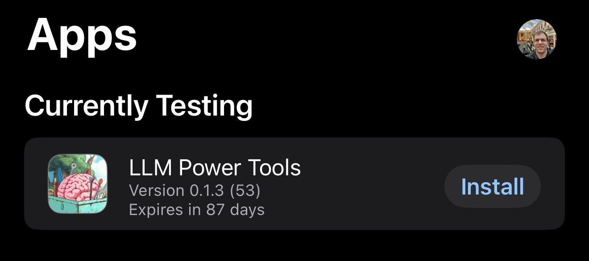

# App Installation (via TestFlight)

1.  Accept the TestFlight invite email from Apple.
2.  Install the official [TestFlight](https://apps.apple.com/us/app/testflight/id899247664) app.
3.  Open TestFlight and you will see "LLM Power Tools" available to install.
    
4.  Tap **INSTALL**.
5.  Once installed, tap **OPEN**.
