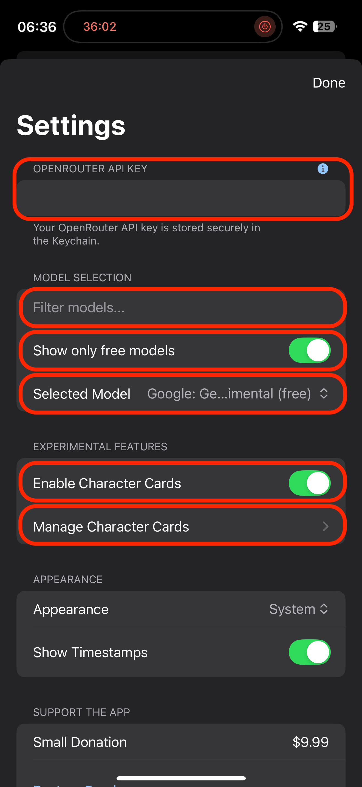

# App Setup

1.  Navigate to the app's **Settings** tab.
2.  *(If you did not yet)* Paste your OpenRouter API key into the `API Key` field.
3.  In the `Filter models..` text field, type `gemini`.
4.  Toggle `Show only free models` to the "on" position.
5.  Select `Google Gemini 2.0 Flash Experimental (free)` from the list.

See the screenshot below for reference (items to interact with are circled):

