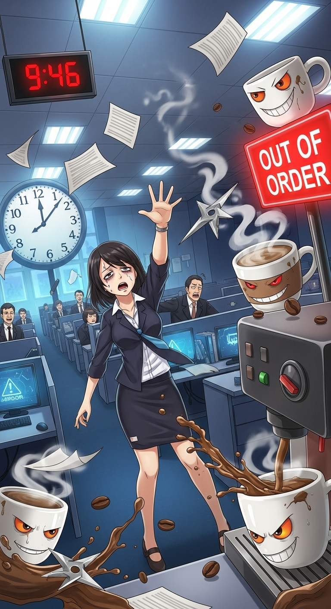

# Download Character Card

You need to save the character card to your iPhone's **Files app**.

**Important: Do not** use "Save to Photos" or "Copy Image" because it will remove the character data from the image.

*Character card credited to [this Discord post](https://discord.com/channels/1100685673633153084/1378119188832321687).*

1.  Long-press the image and choose "Open Image". 
2. Long press the image again select "Share" then "Save to Files".
    - If in Chrome, you may select "Download", the image will be in "On My Iphone -> Chrome" in the files app.
    - If in Safari, you can directly open the image, then choose "Save to Files", you will be prompted to select a location, remember it for the next steps.
2.  Choose a location in Files and tap "Save".

*If it helps, directly visit the image via [https://gungheap.github.io/llm-power-tools-docs/assets/The_Caffeinated_Gauntlet.png](https://gungheap.github.io/llm-power-tools-docs/assets/The_Caffeinated_Gauntlet.png)*
