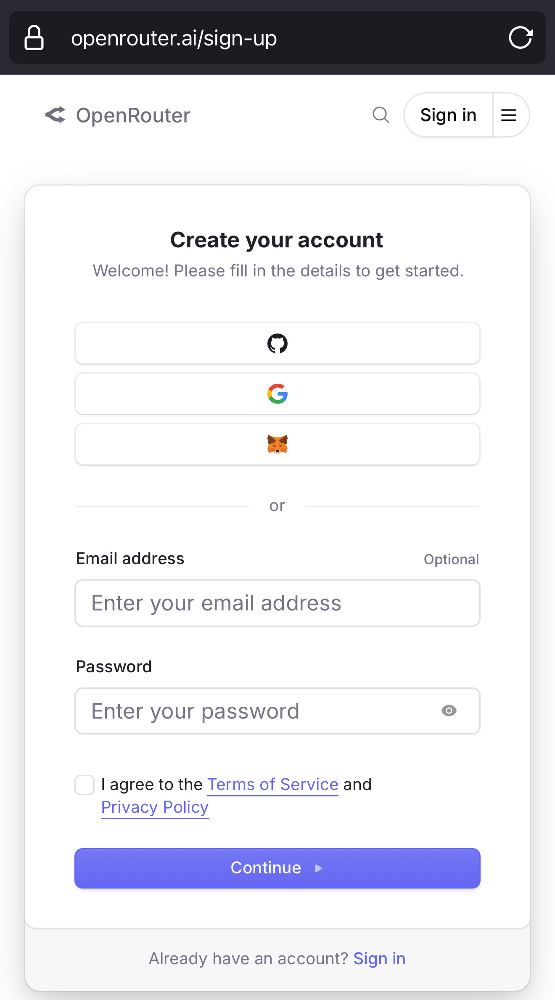
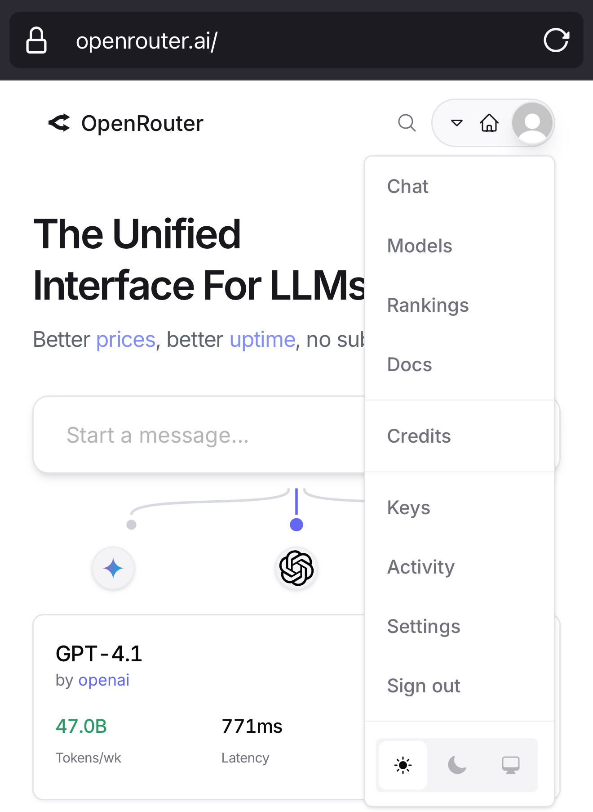
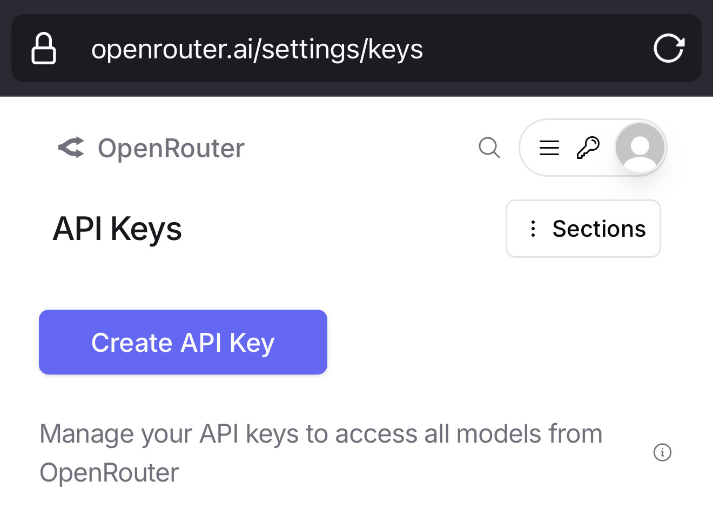
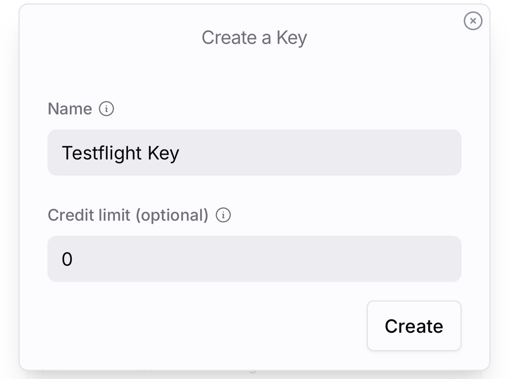
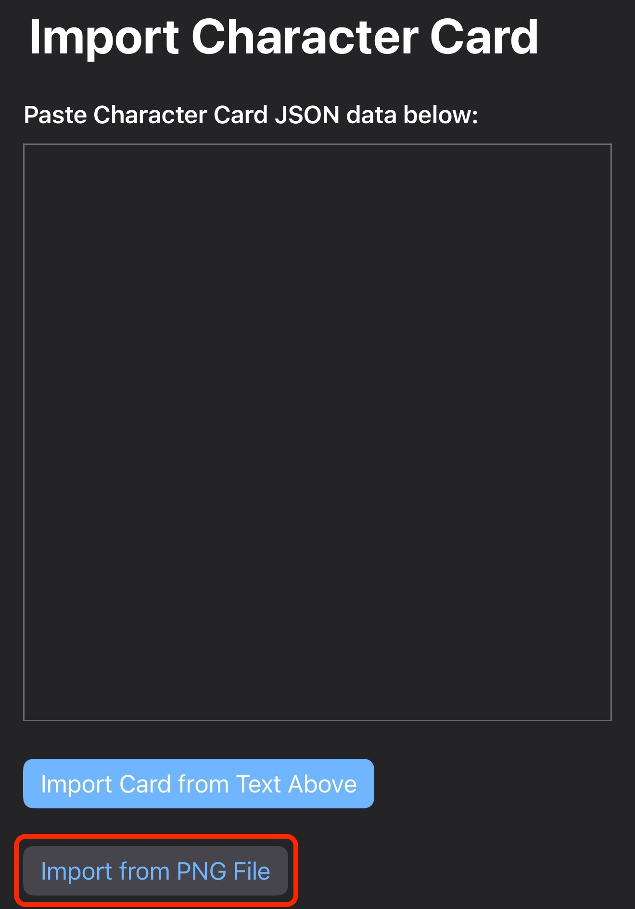
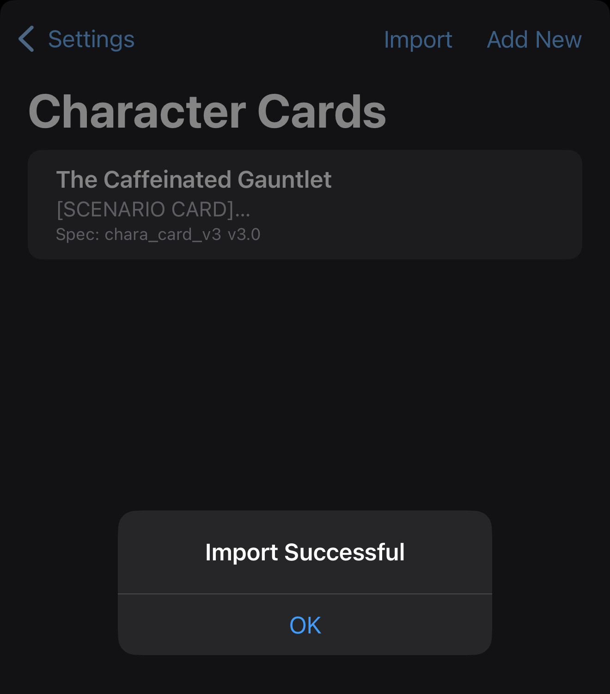
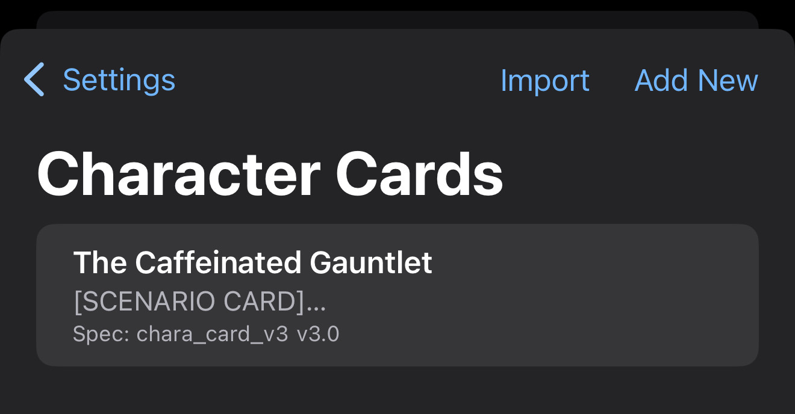
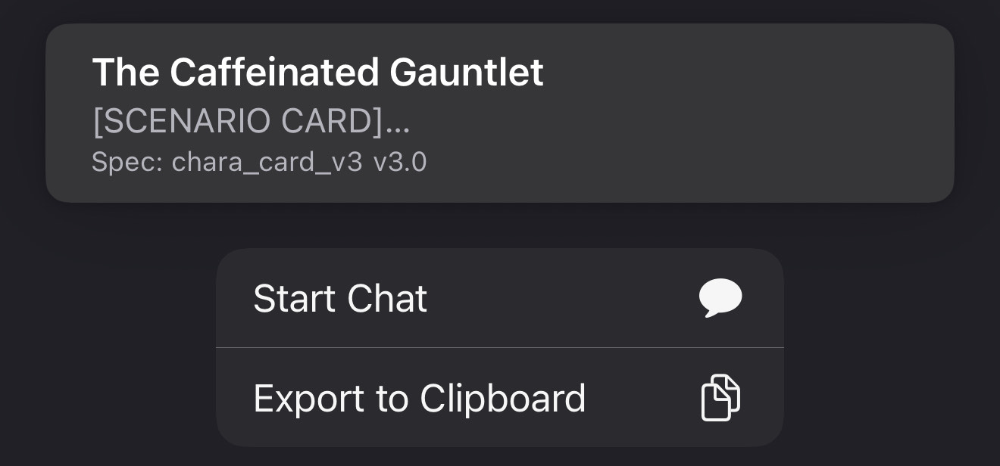
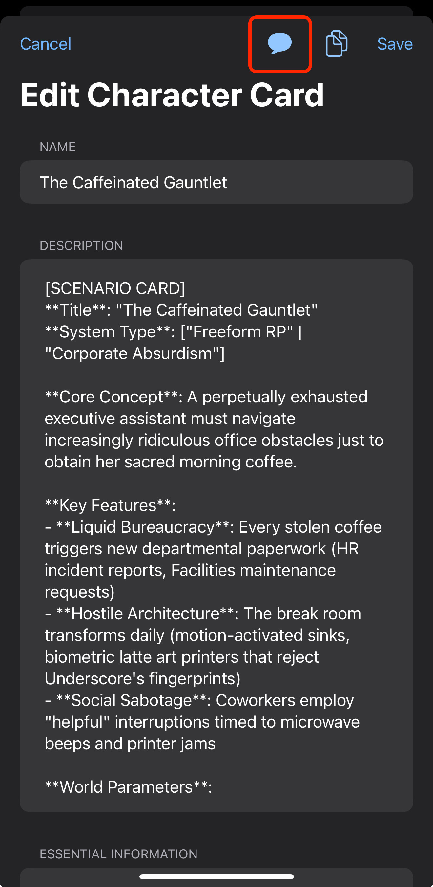

# Getting Started

Open this page on your iphone so you can follow the links directly to the app store.

---
## Table of Contents
* TOC
{:toc}

---
## OpenRouter Setup

It is recommended to do this on your iphone to easily copy the key.

### 1. Create Account at: [https://accounts.openrouter.ai/sign-up](https://accounts.openrouter.ai/sign-up)
*   Recommended: Click the Google "G" button to sign up with Google.

### 2. Create API Key

Do not add payment info at this stage.

1.  Navigate to your account settings by tapping the icon in the top-right, then select "Keys" from the menu.
    

2.  On the Keys page, click "Create Key".
    

3.  Fill out the form:
    *   **Name:** `Testflight Key`
    *   **Credit Limit:** `0`
    *   **Important:** Copy and save your new API key securely. It won't be shown again.
    

4.  Click the "Create" button to finish.
5.  Copy the key and paste it into the app.

---
## App Installation (via TestFlight)

1.  Accept the TestFlight invite email from Apple.
2.  Install the official [TestFlight](https://apps.apple.com/us/app/testflight/id899247664) app.
3.  Open TestFlight and you will see "LLM Power Tools" available to install.
    
4.  Tap **INSTALL**.
5.  Once installed, tap **OPEN**.

---
## App Setup

1.  Navigate to the app's **Settings** tab.
2.  *(If you did not yet)* Paste your OpenRouter API key into the `API Key` field.
3.  In the `Filter models..` text field, type `gemini`.
4.  Toggle `Show only free models` to the "on" position.
5.  Select `Google Gemini 2.0 Flash Experimental (free)` from the list.

See the screenshot below for reference (items to interact with are circled):

---
## Download Character Card

You need to save the character card to your iPhone's **Files app**.

**Important: Do not** use "Save to Photos" or "Copy Image" because it will remove the character data from the image.

*Character card credited to [this Discord post](https://discord.com/channels/1100685673633153084/1378119188832321687).*

1.  Long-press the image and choose "Open Image". 
    - Long press the image again select "Share" then "Save to Files".
    - If in Chrome, you may select "Download", the image will be in "On My Iphone -> Chrome" in the files app.
    - If in Safari, you can directly open the image, then choose "Save to Files", you will be prompted to select a location, remember it for the next steps.
2.  Choose a location and tap "Save".

*If it helps, directly visit the image via [https://gungheap.github.io/llm-power-tools-docs/assets/The_Caffeinated_Gauntlet.png](https://gungheap.github.io/llm-power-tools-docs/assets/The_Caffeinated_Gauntlet.png)*

---
## Import Character Card

This step takes longer to do the first time because of iOS menu structure, I have an improvement, but it's taking some time.

1.  In the app's **Settings** tab, toggle `Enable Character Cards` to the "on" position.
2.  After saving the card, go to the app's **Settings** tab and use the import feature to select the card from your Files app.
    - The photo file may be in "On My iPhone" or "iCloud Drive", you can press back in finder then explore each directory
3.  Import the character card to the app
    - Go back to the app, select "Settings", "Manage Character Cards"
    - Choose "Import", "allow paste"
    - Select "Import from PNG file"
    
    - Navigate to the file from the previous step
    - Clicking the file will import it, with the message "Import Successful"
    
    - The character card will now be in the list as "The Caffeinated Gauntlet"

For more details, see [Importing Character Cards](importing-character-cards.md).

---
## Start the Scenario: The Caffeinated Gauntlet

This scenario is a zany quest to get coffee in a highly bureaucratic workplace.

1.  In the app's **Settings** tab, go to `Manage Character Cards`. You will see a list of your imported character cards.
    

2.  Select "The Caffeinated Gauntlet" from the list.

3.  To start the chat, you have two options:
    *   **Option A (Quick Start):** Long-press on "The Caffeinated Gauntlet" in the list and tap "Start Chat".
        
    *   **Option B (Standard):** After selecting the card, go to the main chat view and tap the speech bubble icon to start a new chat with that character.
        

May your quest for coffee be swift and your TPS reports be few!
