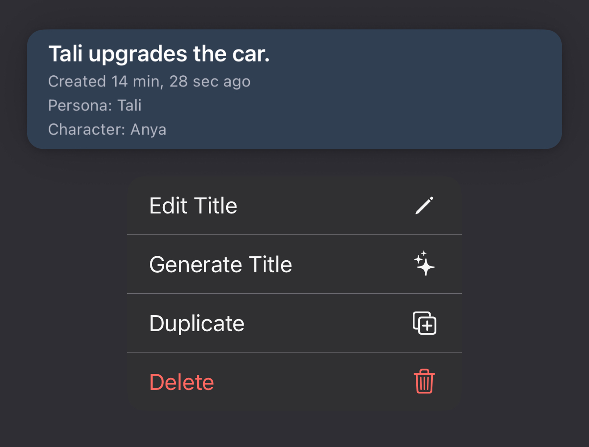
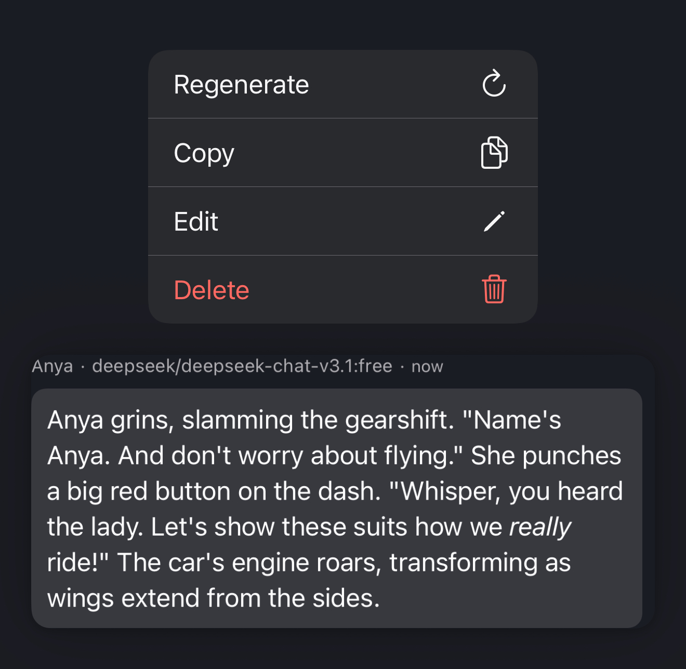
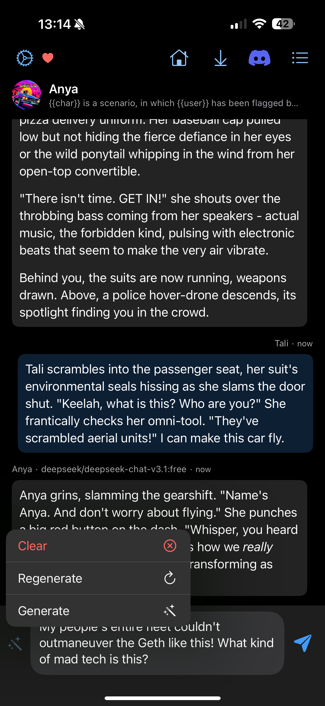

# Advanced Chat Tools

LoreBlendr.AI offers a suite of advanced tools to give you fine-grained control over your chats.

## Chat History Management

In the chat history screen, you can long-press on any chat to bring up a management menu.

From here you can:
- **Edit Title**: Manually edit the title. This is useful for saving on API requests.
- **Generate Title**: Automatically generate a title for your chat using the currently selected model. Note that AI models are selected globally, not on a per-chat basis.
- **Duplicate Chat**: Create an exact copy of the chat, including its title and content.
- **Delete Chat**: Permanently delete the chat. Be careful, as there is no confirmation step.

## In-Chat Message Management

Inside a chat, you can long-press on any message (from you or the AI) to access more options.

- **Regenerate**: Ask the AI to generate a new response from that point.
- **Copy**: Copy the message content to your clipboard.
- **Edit**: Modify the content of the message. This will affect all subsequent messages but will not alter existing messages that follow it.
- **Delete**: Remove the message from the chat history.

## User Message Input Tools

Before you send a message, there are tools to help you craft the perfect response.

Tap the magic wand icon to access these features:

- **Clear Message**: Empties the text input box.
- **Regenerate Message**: If you've already typed something, you can tap this to have the AI rewrite it, keeping the context of the conversation.
- **Generate Message**: Have the AI generate a message for you, based on the conversation so far. This will populate the text box with a new message.

## Generation Controls

While the AI is generating a response, you have a couple of options:
- **Stop**: You can interrupt the generation at any point by tapping the stop button.
- **Fast Forward**: Once the generation is complete, a fast-forward button appears. Tapping it will skip the typewriter animation and display the full message immediately. This button is only available after the message is fully generated.

