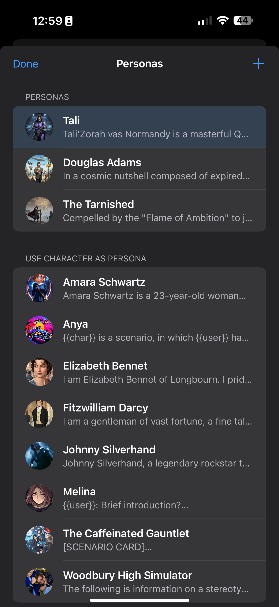
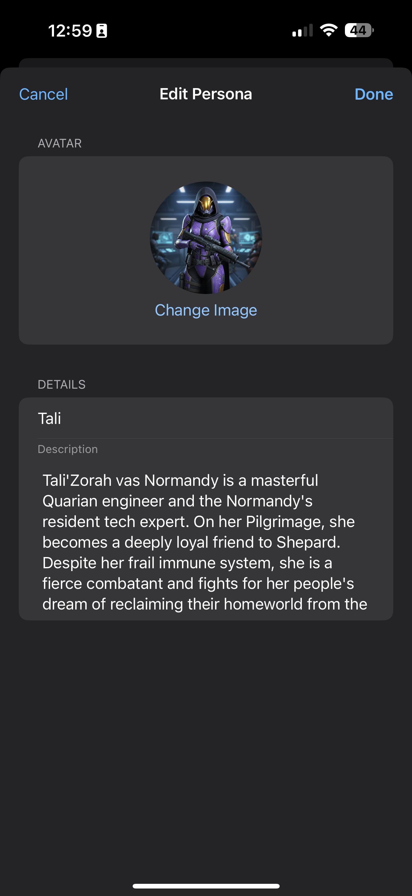
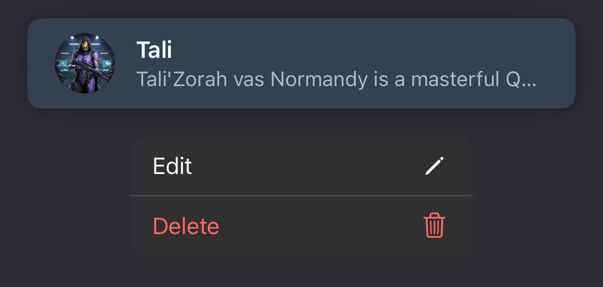

# Create and Manage Personas

Personas define the "voice" you use when chatting with characters. You can create personas for different scenarios.

- [Select a Persona](#select-a-persona)
- [Create a New Persona](#create-a-new-persona)
- [Edit or Delete a Persona](#edit-or-delete-a-persona)

### Select a Persona
1.  Go to the **Manage Personas** screen.
2.  Tap a persona to select it for new chats. The selected persona is highlighted in blue.

### Create a New Persona
1.  From the **Manage Personas** screen, tap the **+** button.
2.  Fill in the details for your persona and save.

Tip: Use any AI chat to create a persona and image. You can even use a character designed to create personas.

### Edit or Delete a Persona
1.  From the **Manage Personas** screen, **long-press** on a persona to open the context menu.
2.  Tap "Edit" or "Delete".

