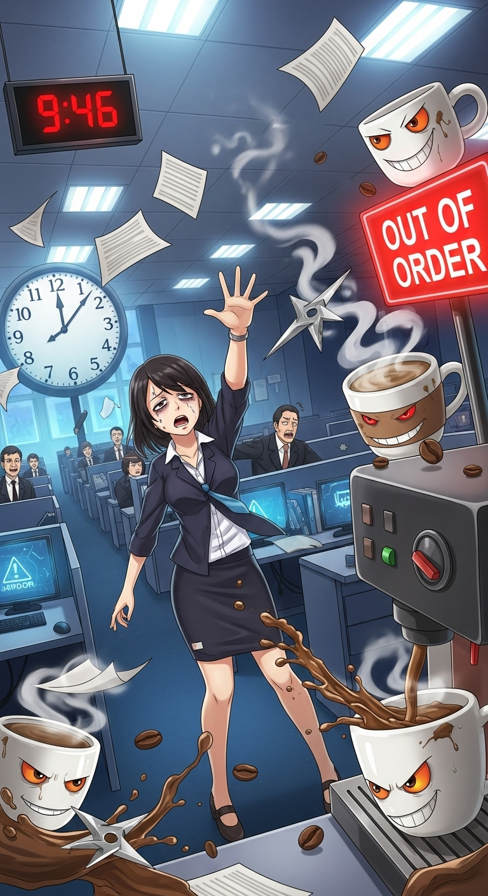

# Download Character Card

There are [many character card repositories online](/character-cards).

This character card is a fun and safe-for-work example.

You need to save the character card to your iPhone's **Files app**.

**Important: Do not** use "Save to Photos" or "Copy Image" because it will remove the character data from the image.

*Character card credited to [this Discord post](https://discord.com/channels/1100685673633153084/1378119188832321687).*

1. Long-press the image and choose "Open Image". 
    - *Or directly visit the image via [https://raw.githubusercontent.com/loreblendr-ai/loreblendr.ai/refs/heads/main/assets/The_Caffeinated_Gauntlet.png](https://raw.githubusercontent.com/loreblendr-ai/loreblendr.ai/refs/heads/main/assets/The_Caffeinated_Gauntlet.png)*
    
2. Long press the image again select "Share" then "Save to Files".
    - In Chrome, you may select "Download", the image will be in "On My Iphone -> Chrome" in the files app.
2. If you do not see "download", then choose a location in Files and tap "Save".
    - Remember the location for the next step.
