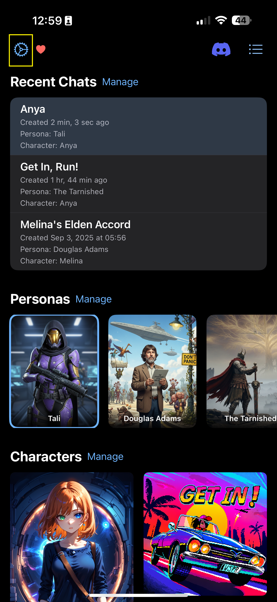

# Import Lorebook

Lorebooks allow you to provide additional context and information to the AI during your chats. Here's how to import or create a lorebook.

## Import from File

### 1. Open Settings

Navigate to the **Settings** tab by tapping the gear icon on the top left of the home screen.

### 2. Navigate to Lorebook Settings

In the Settings menu, select **Lorebooks**.

### 3. Lorebook Manager

This brings you to the Lorebook Manager, where all your lorebooks are listed. You have three options for adding a new lorebook, represented by the icons at the top right:

### 4. Import from File

If you have a lorebook saved as a `.json` file on your device:

1.  Tap the **Import from File** icon (folded file with a plus symbol).
2.  Your device's file browser will open, allowing you to select the `.json` file to import.

## Import from Clipboard

If you have copied the contents of a lorebook as JSON text:

1.  Tap the **Import from Clipboard** icon (down arrow into a box).
2.  Paste the JSON text into the text area and tap **Import**.

## Create a New Lorebook

To create a new lorebook from scratch:

1.  Tap the **New Lorebook** icon (the plus symbol).
2.  This will open the Lorebook Editor, where you can define your lorebook's entries.

## Edit and Export a Lorebook

1. Tap the lorebook to edit it. There will be an export button.
