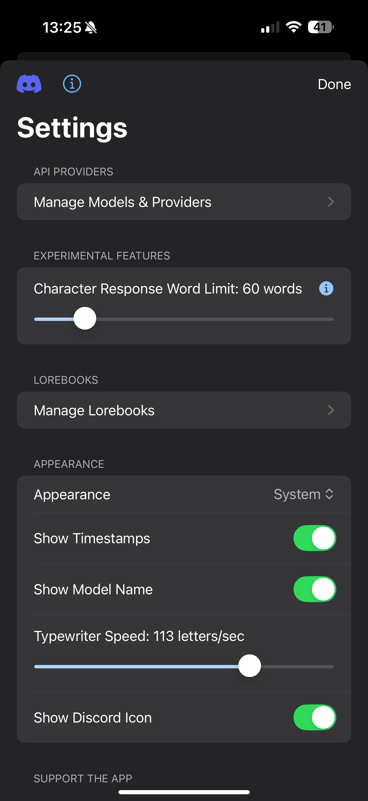
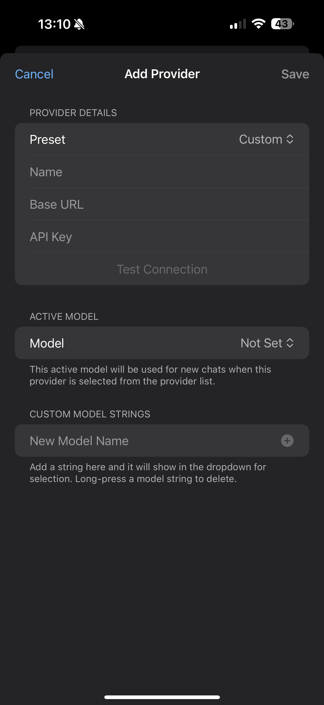
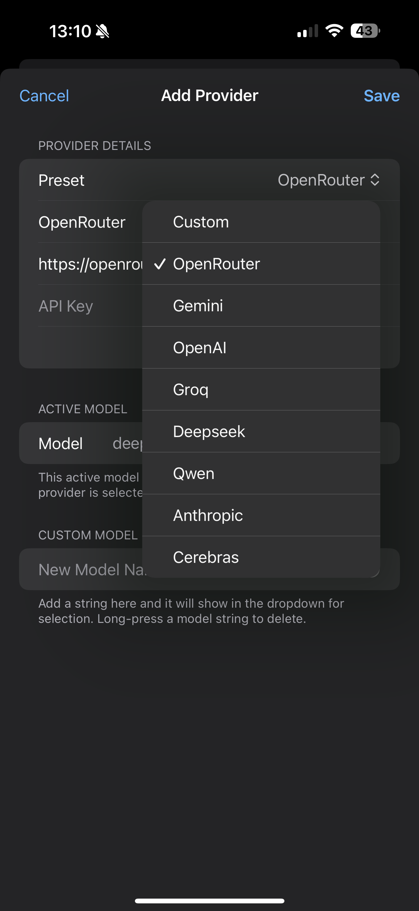
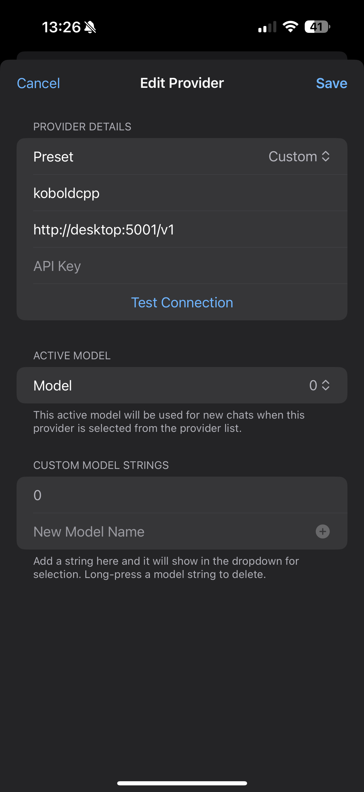

# Provider Setup

Follow these steps to add and configure an AI provider.

1.  Navigate to the **Settings** tab by tapping the gear icon on the home screen.
    

2.  Tap on **Manage Models & Providers**.
    

3.  Tap the **+** button to open the "Add Provider" screen.
    

4.  Select a preset for a popular service like OpenRouter or Kobold Horde.
    

5.  You can also configure a **Custom Provider** if you have your own API endpoint.
    
