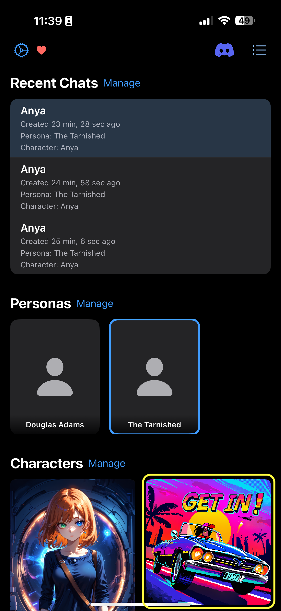

# Start a Chat

1.  Navigate to the **Chat** tab.
2.  Tap on the character card to start a chat. This will use your selected persona, response length, and model.

*   **Pro-tip:** You can dynamically update which lorebooks are active for each message.
